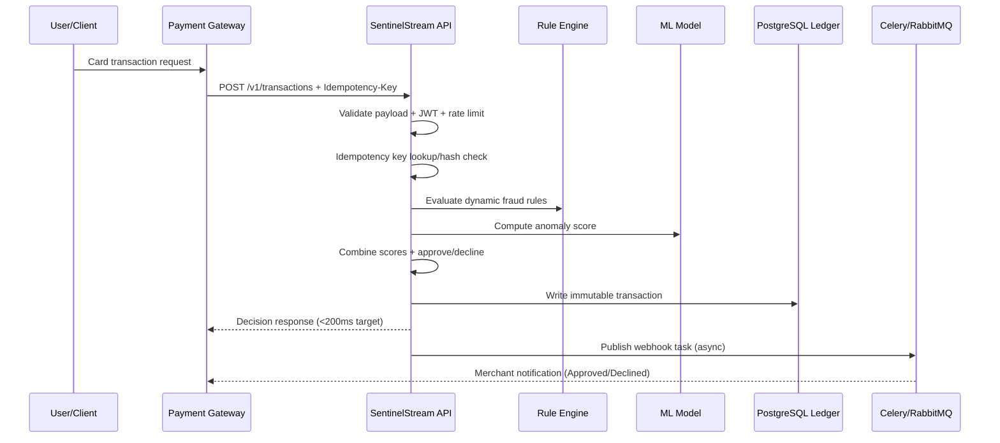

# High-Speed Sequence Diagram

```mermaid
sequenceDiagram
    participant U as User/Client
    participant G as Payment Gateway
    participant S as SentinelStream API
    participant R as Rule Engine
    participant M as ML Model
    participant P as PostgreSQL Ledger
    participant Q as Celery/RabbitMQ

    U->>G: Card transaction request
    G->>S: POST /v1/transactions + Idempotency-Key
    S->>S: Validate payload + JWT + rate limit
    S->>S: Idempotency key lookup/hash check
    S->>R: Evaluate dynamic fraud rules
    S->>M: Compute anomaly score
    S->>S: Combine scores + approve/decline
    S->>P: Write immutable transaction
    S-->>G: Decision response (<200ms target)
    S->>Q: Publish webhook task (async)
    Q-->>G: Merchant notification (Approved/Declined)
```
